# ATOM VPN SDK demo for macOS Applications
This is a demo application for macOS Applications with basic usage of ATOM VPN SDK which will help the developers to create smooth applications over ATOM SDK quickly.

## SDK Features covered in this Demo
* Connection with Parameters
* Connection with Dedicated IP
* Connection with Multiple Protocols (Auto-Retry Functionality)
* Connection with Real-time Optimized Servers (Countries based on latency from user in Real-time)
* Connection with Smart Dialing (Use getCountriesForSmartDialing() to get the Advanced VPN Dialing supported countries)


## Compatibility
* Compatible with Xcode 15.3, macOS 10.13 and later
* Compatible with ATOM SDK Version 5.0 and onwards


## Supported Protocols
* IPSec
* IKEv2
* TCP
* UDP
* Wireguard


## SDK Installation

### CocoaPods

[CocoaPods](https://cocoapods.org) is a dependency manager for Cocoa projects. For usage and installation instructions, visit their website. To integrate AtomSDK into your Xcode project using CocoaPods, specify it in your `Podfile`:

```ruby
pod 'AtomSDKBySecure'
pod 'AtomSDKTunnel'
```

### Integrate AtomWireguardTunnel in macOS App for Wireguard Protocol
You can add AtomWireguardTunnel package via Swift Package Manager

1. Open your project in Xcode 15.3 or above
2. Go to File > Swift Packages > Add Package Dependency...
3. In the field Enter package repository URL, enter "https://github.com/AtomSDK/AtomWireguardTunnel"
4. Choose Dependency Rule "Branch", and add the branch name "main"


# Getting Started with the Code
To add the SDK in Xcode:

1. Open your Xcode project.
2. Add your developer account to Xcode from Preferences -> Account if you didn't add before.
3. Select General tab from your app target and then set your developer account details.
4. From your app target select Capabilities tab and select the switch right of the Personal VPN. Then select the capabilties you are going to use.
5. Drag and drop AtomSDK.framework into your project. (Skip if using Cocoapods)
6. Go to your project -> General tab from your app target, add the framework using ‘+’ to the Embedded Binaries section. (Skip if using Cocoapods)
8. After the setup is completed, you should be able to use all the classes from the SDK by including it with the #import <AtomSDK/AtomSDK.h> directive.
9. ATOM SDK needs to be initialized with a “SecretKey” provided to you after you buy the subscription which is typically a hex-numeric literal.

It can be initialized using an instance of AtomConfiguration. It should have a vpnInterfaceName which will be used to create the Network Interface for VPN connection. 

```ruby
    AtomConfiguration *atomConfiguration= [[AtomConfiguration alloc] init];
    atomConfiguration.secretKey = @"SECRETKEY_GOES_HERE";
    atomConfiguration.vpnInterfaceName = @"Atom";
    atomConfiguration.tunnelProviderBundleIdentifier = “ENTER_YOUR _NETWORK_EXTENSION_BUNDLE_ID”;
    atomConfiguration.wireGuardTunnelProviderBundleIdentifier = “ENTER_YOUR_WIREGUARD_NETWORK_EXTENSION_BUNDLE_ID”;
    [AtomManager sharedInstanceWithAtomConfiguration:atomConfiguration];
```

PS: ATOM SDK is a singleton, and must be initialized before accessing its methods.

## Enable Local Inventory Support
ATOM SDK offers a feature to enable the local inventory support. This can help Application to fetch Countries and Protocols even when device network is not working.

* To enable it, Log In to the Atom Console
* Download the local data file in json format
* File name should be localdata.json. Please rename the file to localdata.json if you find any discrepancy in the file name.
* Paste the file in root of your application folder.

## Delegates to Register
ATOM SDK offers four delegates to register for the ease of the developer.
* atomManagerDidConnect:
* atomManagerDidDisconnect:
* atomManagerOnRedialing:
* atomManagerDialErrorReceived:
* atomManagerOnUnableToAccessInternet:
* atomManagerDidReceiveConnectedLocation:

## StateDidChangedHandler to monitor a VPN connection status
ATOM SDK offers stateDidChangedHandler for the ease of the developer.
```ruby
[AtomManager sharedInstance].stateDidChangedHandler = ^(AtomVPNState status) { };
```


## VPN Authentication
ATOM SDK provided two ways to authenticate your vpn user.
First one is to offer VPN Credentials directly to the SDK which you may create through the Admin Panel provided by ATOM.

```ruby
[AtomManager sharedInstance].atomCredential = [[AtomCredential alloc] initWithUsername:@"<username>" password:@"<password>"];
```

## VPN Connection
You need to declare an object of “AtomProperties” Class to define your connection preferences. Details of all the available properties can be seen in the inline documentation of “AtomProperties” Class. For the least, you need to give Country and Protocol with which you want to connect.

```ruby
AtomProperties* properties = [[AtomProperties alloc] initWithCountry:@"<country>" protocol:@"<protocol>"];
```
## Fetch Countries
Countries can be obtained through ATOM SDK as well.
```ruby
[[AtomManager sharedInstance] getCountriesWithSuccess:^(NSArray<AtomCountry *> *success) {}
} errorBlock:^(NSError *error) {}];
```

## Fetch Recommended Country
You can get the Recommended Country for user's location through ATOM SDK.
```ruby
[[AtomManager sharedInstance] getRecommendedCountry:^(AtomCountry *country) {
} errorBlock:^(NSError *error) {
}];
```

## Fetch Countries For Smart Dialing
You can get the Countries those support Smart Dialing through ATOM SDK.
```ruby
[[AtomManager sharedInstance] getCountriesForSmartDialing:^(NSArray<AtomCountry *> *success) {}
} errorBlock:^(NSError *error) {}];
```

## Fetch Protocols
Protocols can be obtained through ATOM SDK as well.

```ruby
[[AtomManager sharedInstance] getProtocolsWithSuccess:^(NSArray<AtomProtocol *> *success) {}
errorBlock:^(NSError *error) {}];
```

## VPN Connection Speed
For VPN connection speed you need to registor onPacketsTransmitted handler from AtomManager class to get the VPN connection speed in bytes per second. This callback is recieve only in VPN connected state.
```ruby
AtomManager.sharedInstance.onPacketsTransmitted = ^(NSNumber *bytesReceived, NSNumber *bytesSent) {
    NSLog(@"bytesIN: %ld | bytesOUT: %ld ",(long)bytesReceived.integerValue,bytesSent.integerValue);
};
```

## Protocol switch
You can enable or disable protocol switch from VPNProperties class. By default its value is set to true.
```ruby
properties.enableProtocolSwitch = false;
```
or
```ruby
properties.enableProtocolSwitch = true;
```

## Recommanded protocol
If you didn't specify the protocol in case of Country, City and Channel dailing then Atom SDK dialed with recommanded protocol according to the specified country, city and channel. It will not work for dedicated IP.

## Use Failover
Failover is a mechanism in which Atom dialed with nearest server if requested server is busy or not found for any reason. You can control this mechanism from VPNPorperties class. By default its value is set to true.
```ruby
properties.useFailover = false;
```
or
```ruby
properties.useFailover = true;
```

## How to Connect

As soon as you call Connect method, the events you were listening to will get the updates about the states being changed and VPNDialedError  (if any occurs) as well.


### Connection with Parameters
It is the simplest way of connection which is well explained in the steps above. You just need to provide the country and the protocol objects and call the Connect method.
```ruby
AtomProperties* properties = [[AtomProperties alloc] initWithCountry:@"<#country#>" protocol:@"<#protocol#>"];

[[AtomManager sharedInstance] connectWithProperties:properties completion:^(NSString *success) {}
errorBlock:^(NSError *error) {}];
```

### Include or Exclude Server with Nas Identifier
When connecting with parameters, a server can be included or excluded with its Nas Identifier
```ruby
AtomProperties* properties = [[AtomProperties alloc] initWithCountry:@"<#country#>" protocol:@"<#protocol#>"];
NSMutableArray<ServerFilter *> *serverFilters = [NSMutableArray new];
[serverFilters addObject:[[ServerFilter alloc] initWithNasIdentifier:@"nas-identifier-here"" andFilter:INCLUDE]];
[serverFilters addObject:[[ServerFilter alloc] initWithNasIdentifier:@"nas-identifier-here" andFilter:EXCLUDE]];
[properties setServerFilters:serverFilters];
[[AtomManager sharedInstance] connectWithProperties:properties completion:^(NSString *success) {}
errorBlock:^(NSError *error) {}];
``` 

### Connection with Dedicated IP
You can also make your user comfortable with this type of connection by just providing them with a Dedicated IP/Host and they will always connect to a dedicated server! For this purpose, ATOM SDK provides you with the following constructor.
```ruby
AtomProperties *properties = [[AtomProperties alloc] initWithDedicatedHostName:@"<#DedicatedIP/Host#>" protocol:@"<#protocol#>"];

[[AtomManager sharedInstance] connectWithProperties:properties completion:^(NSString *success) {}
errorBlock:^(NSError *error) {}];
```

### Connection with Real-time Optimized Servers
This one is same as the first one i.e. “Connection with Parameters” with a slight addition of using Real-time optimized servers best from your user’s location. You just need to set this property to TRUE and rest will be handled by the ATOM SDK.
```ruby
AtomProperties* properties = [[AtomProperties alloc] initWithCountry:@"<#country#>" protocol:@"<#protocol#>"];
[properties setUseOptimization:YES];

[[AtomManager sharedInstance] connectWithPropertiesconnectWithProperties:properties completion:^(NSString *success) {}
errorBlock:^(NSError *error) {}];
```

If you want to show your user the best location for him on your GUI then ATOM SDK have it ready for you as well! ATOM SDK has a method exposed namely “getOptimizedCountries” which adds a property “RoundTripTime” in the country object which has the real-time latency of all countries from your user’s location (only if ping is enabled on your user’s system and ISP doesn’t blocks any of our datacenters). You can use this property to find the best speed countries from your user’s location.

### Connection with Smart Dialing
“Connection with Parameters” with a slight addition of using smart dialing to connect. You just need to call "withSmartDialing" and rest will handled by the ATOM SDK.
```ruby
AtomProperties* properties = [[AtomProperties alloc] initWithCountry:@"<#country#>" protocol:@"<#protocol#>"];
[properties setUseSmartDialing:YES];
[[AtomManager sharedInstance] connectWithProperties:properties completion:^(NSString *success) {}
errorBlock:^(NSError *error) {}];
```

For more information, please see the inline documentation of AtomProperties Class.

### Connection with Multiple Protocols (Auto-Retry Functionality)
You can provide three protocols at max so ATOM SDK can attempt automatically on your behalf to get your user connected with the Secondary or Tertiary protocol if your base Protocol fails to connect. 

```ruby
properties.secondaryProtocol = @"<protocol2>";
properties.tertiaryProtocol = @"<protocol3>";
```

### Connection with On Demand Custom Rules
On Demand Custom Rules allow you to configure automatic VPN connection and disconnection based on network conditions, Wi-Fi SSIDs, DNS settings, and other network parameters. This feature provides fine-grained control over when the VPN should automatically connect or disconnect.

#### Key Properties
The On Demand Custom Rules feature is controlled through the `AtomOnDemandConfiguration` class with two main properties:

1. **isOnDemandCustomRulesEnabled** (BOOL): A boolean flag that enables or disables the use of custom On-Demand VPN rules. When set to `YES`, the SDK will apply the rules provided in `OnDemandCustomRules`. Default value is `NO`.

2. **OnDemandCustomRules** (NSArray): An array of `AtomOnDemandRule` objects representing custom On-Demand VPN rules. These rules are applied automatically by the SDK when `isOnDemandCustomRulesEnabled` is set to `YES`.

#### Rule Types
ATOM SDK supports four types of On-Demand rules:

1. **AtomOnDemandConnectRule**: Automatically connects the VPN when the rule conditions are met.
2. **AtomOnDemandDisconnectRule**: Automatically disconnects the VPN when the rule conditions are met.
3. **AtomOnDemandIgnoreRule**: Leaves the VPN connection state unchanged when the rule matches.
4. **AtomOnDemandEvaluateConnectionRule**: Evaluates network connections and determines whether the VPN should connect based on defined connection rule items.

#### Integration Steps

**Step 1: Create On-Demand Configuration**
Create an instance of `AtomOnDemandConfiguration` and enable custom rules:

```ruby
AtomOnDemandConfiguration *onDemandConfiguration = [[AtomOnDemandConfiguration alloc] init];
onDemandConfiguration.onDemandRulesEnabled = YES;
onDemandConfiguration.isOnDemandCustomRulesEnabled = YES;
```

**Step 2: Create Custom Rules**
Create the desired rule objects and add them to the configuration:

```ruby
// Example: Connect rule for specific Wi-Fi SSIDs
AtomOnDemandConnectRule *connectRule = [[AtomOnDemandConnectRule alloc] 
    initWithSSIDMatch:@[@"PublicWiFi", @"AirportWiFi"] 
    interfaceType:AtomOnDemandInterfaceTypeWifi];

// Example: Disconnect rule for trusted Wi-Fi networks
AtomOnDemandDisconnectRule *disconnectRule = [[AtomOnDemandDisconnectRule alloc] 
    initWithSSIDMatch:@[@"HomeWiFi", @"OfficeWiFi"] 
    interfaceType:AtomOnDemandInterfaceTypeWifi];

// Example: Ignore rule to maintain VPN state on specific networks
AtomOnDemandIgnoreRule *ignoreRule = [[AtomOnDemandIgnoreRule alloc] 
    initWithSSIDMatch:@[@"GuestNetwork"] 
    interfaceType:AtomOnDemandInterfaceTypeWifi];

// Add rules to configuration
onDemandConfiguration.OnDemandCustomRules = @[connectRule, disconnectRule, ignoreRule];
```

**Step 3: Apply Configuration**
Set the configuration to AtomManager and update it:

```ruby
[[AtomManager sharedInstance] setOnDemandConfiguration:onDemandConfiguration];
[[AtomManager sharedInstance] updateOnDemandVpnStatusWithCompletion:^(NSString * _Nullable success) {
    NSLog(@"On Demand Custom Rules updated successfully");
} errorBlock:^(NSError * _Nullable error) {
    NSLog(@"Error updating On Demand Rules: %@", error.localizedDescription);
}];
```

#### Advanced Rule Configuration

**Rule with DNS Settings**
You can configure rules with DNS search domains and DNS server addresses:

```ruby
AtomOnDemandConnectRule *connectRule = [[AtomOnDemandConnectRule alloc] 
    initWithSSIDMatch:nil 
    interfaceType:AtomOnDemandInterfaceTypeAny];
connectRule.dnsSearchDomains = @[@"example.com", @"internal.company.com"];
connectRule.dnsServerAddresses = @[@"8.8.8.8", @"8.8.4.4"];
connectRule.probeURL = [NSURL URLWithString:@"https://www.example.com/probe"];
```

**Evaluate Connection Rule**
Use `AtomOnDemandEvaluateConnectionRule` for more complex scenarios where you need to evaluate connections to specific domains:

```ruby
AtomOnDemandEvaluateConnectionRuleItem *ruleItem = [[AtomOnDemandEvaluateConnectionRuleItem alloc] 
    initWithMatchDomains:@[@"restricted-site.com", @"blocked-domain.com"] 
    action:AtomOnDemandEvaluateConnectionRuleActionConnectIfNeeded 
    dnsServers:@[@"1.1.1.1"] 
    probeURL:[NSURL URLWithString:@"https://www.example.com/connectivity-check"]];

AtomOnDemandEvaluateConnectionRule *evaluateRule = [[AtomOnDemandEvaluateConnectionRule alloc] 
    initWithConnectionRules:@[ruleItem] 
    interfaceType:AtomOnDemandInterfaceTypeAny];

onDemandConfiguration.OnDemandCustomRules = @[evaluateRule];
```

#### Interface Types
Rules can be applied to different network interfaces:

- `AtomOnDemandInterfaceTypeAny`: Applies to any network interface (default)
- `AtomOnDemandInterfaceTypeWifi`: Applies only to Wi-Fi connections
- `AtomOnDemandInterfaceTypeCellular`: Applies only to cellular connections (iOS only)
- `AtomOnDemandInterfaceTypeEthernet`: Applies only to Ethernet connections (macOS/tvOS only)

**Note:** The interface type enum values are exposed from Swift to Objective-C. Use the full enum name as shown in the examples above.

#### Complete Example
Here's a complete example showing how to set up On Demand Custom Rules:

```ruby
// Create and configure On-Demand settings
AtomOnDemandConfiguration *onDemandConfiguration = [[AtomOnDemandConfiguration alloc] init];
onDemandConfiguration.onDemandRulesEnabled = YES;
onDemandConfiguration.isOnDemandCustomRulesEnabled = YES;

// Create rules array
NSMutableArray *rules = [NSMutableArray new];

// Rule 1: Connect VPN on untrusted Wi-Fi networks
AtomOnDemandConnectRule *connectRule = [[AtomOnDemandConnectRule alloc] 
    initWithSSIDMatch:@[@"PublicWiFi", @"CoffeeShop"] 
    interfaceType:AtomOnDemandInterfaceTypeWifi];
[rules addObject:connectRule];

// Rule 2: Disconnect VPN on trusted Wi-Fi networks
AtomOnDemandDisconnectRule *disconnectRule = [[AtomOnDemandDisconnectRule alloc] 
    initWithSSIDMatch:@[@"HomeNetwork", @"OfficeNetwork"] 
    interfaceType:AtomOnDemandInterfaceTypeWifi];
[rules addObject:disconnectRule];

// Rule 3: Connect VPN on cellular networks
AtomOnDemandConnectRule *cellularRule = [[AtomOnDemandConnectRule alloc] 
    initWithSSIDMatch:nil 
    interfaceType:AtomOnDemandInterfaceTypeCellular];
[rules addObject:cellularRule];

// Set rules
onDemandConfiguration.OnDemandCustomRules = rules;

// Apply configuration
[[AtomManager sharedInstance] setOnDemandConfiguration:onDemandConfiguration];
[[AtomManager sharedInstance] updateOnDemandVpnStatusWithCompletion:^(NSString * _Nullable success) {
    NSLog(@"On Demand Custom Rules updated successfully");
} errorBlock:^(NSError * _Nullable error) {
    NSLog(@"Error updating On Demand Rules: %@", error.localizedDescription);
}];
```

#### Important Notes
- Rules are evaluated in the order they are added to the `OnDemandCustomRules` array.
- If `SSIDMatch` is `nil` or empty, the rule applies to all networks of the specified interface type.
- The `probeURL` is used to test connectivity before applying connection rules.
- Ensure that `onDemandRulesEnabled` is set to `YES` for any On-Demand functionality to work.

For more information, please see the inline documentation of `AtomOnDemandConfiguration` and `AtomOnDemandRule` classes.

## Cancel VPN Connection
You can cancel connection between dialing process by calling the cancelVPN method.
```ruby
[[AtomManager sharedInstance] cancelVPN];
```
## Disconnect VPN Connection
To disconnect, simply call the disconnectVPN method of AtomManager.
```ruby
[[AtomManager sharedInstance] disconnectVPN];
```

## Remove VPN Profile
To remove VPN profile, simply call the removeVPNProfileWithCompletion method of AtomManager.
```ruby
[[AtomManager sharedInstance] removeVPNProfileWithCompletion:^(BOOL isSuccess) {
}];
```

## Pause / Resume VPN Connection
This section provides details about the VPN Pause and Resume feature in the Atom SDK, allowing users to temporarily pause VPN connections for a specified duration. This feature is useful when users need to suspend VPN activity without fully disconnecting.

### Feature Overview
The VPN Pause feature allows pausing a VPN connection under specific conditions and includes one mode:
- **Timed Pause:** Pauses the VPN connection for a preset duration, after which it automatically resumes. Users can’t resume the connection manually before the timer completes.

#### Key Rules and Conditions:
1. VPN can be paused only when it is in Connected state.
2. VPN can be resumed only when it is in Paused state.
3. A paused VPN can still be disconnected using the SDK's Disconnect method.
4. During a timed pause, users can manually resume the VPN at any time using the Resume method.

### Integration Guide:

#### Setup Tunnel Delegates:

##### startTunnel:
This delegate is being invoked when the VPN enters a start state. Implement this delegate in PacketTunnelProvider.swift.
```
override func startTunnel(options: [String : NSObject]?, completionHandler: @escaping (Error?) -> Void) {
    super.startTunnel(options: options, completionHandler: completionHandler)
}
```

##### stopTunnel:
This delegate is being invoked when the VPN enters a stop state. Implement this delegate in PacketTunnelProvider.swift.
```
override func stopTunnel(with reason: NEProviderStopReason, completionHandler: @escaping () -> Void) {
    super.stopTunnel(with: reason, completionHandler: completionHandler)
}
```

##### handleAppMessage:
This delegate is being invoked for the communication between app and tunnel. Implement this delegate in PacketTunnelProvider.swift.
```
override func handleAppMessage(_ messageData: Data, completionHandler: ((Data?) -> Void)? = nil) {
    super.handleAppMessage(messageData, completionHandler: completionHandler)
}
```

#### Pause VPN delegation:
This delegate is being invoked when the VPN enters a pause state. Implement this delegate to handle any pause-specific operations.
```
func atomManagerDidPaused(_ atomConnectionDetails: AtomConnectionDetails?) {
	//
}
```
`atomManagerDidPaused` delegate contains one argument:
- **ConnectionDetails:** Contains the connection related details.

#### Pause / Resume VPN Methods:

##### Pause VPN
Pauses the VPN connection based on the interval provided. The available values for `PauseVPNTimer` include various timed options (e.g., 5, 10, 15, 20) as defined in the enum below.
```
AtomManager.sharedInstance()?.pause(with: .MINUTES_5, withCompletion: { error in
	//
})
```
```
enum PauseVPNTimer 
{
    MINUTES_5, MINUTES_10, MINUTES_15, MINUTES_20
}
```

##### Resume VPN
Resumes the VPN connection if it is in the paused state. On successful resume, `atomManagerDidConnect` delegate will be invoked otherwise in case of an error `atomManagerDialErrorReceived` delegate will be invoked.
```
AtomManager.sharedInstance()?.resume(completion: { error in
	//
})
```
```
func atomManagerDidConnect(_ atomConnectionDetails: AtomConnectionDetails?) {
	//
}
```
```
func atomManagerDialErrorReceived(_ error: Error?, with atomConnectionDetails: AtomConnectionDetails?) {
	//
}
```

#### VPN State Management:
The SDK provides additional VPN statuses

- **PAUSING**
- **PAUSED**

You can request the current VPN state using the following method:

```
AtomManager.sharedInstance()?.getCurrentVPNStatus()
```

#### Handle State Changes:
SDK also provides all VPN states via `StateDidChangedHandler` as below
```
AtomManager.sharedInstance()?.stateDidChangedHandler = AtomStateListener().stateChanged

fileprivate let stateChanged: StateDidChangedHandler = { atomState in
	//
}
```

#### Pause/Resume Information in Connection Details:
The following properties are available in the connection details related to this feature:
- `pauseVPNTimer`: Returns a `PauseVPNTimer`, indicating the duration for which the VPN is paused.
- `isVPNAutoResumed`: Returns a boolean indicating whether the VPN was resumed manually or automatically after the pause timer expired.

#### Error Handling:
Following are the error details for this feature:

| Error Code | Error Message | Description |
| :----------: | ------------- | ----------- |
| 5194 | Unable to resume, the VPN connection is not in a paused state. | If VPN is not PAUSED and try to resume vpn, the error occurs and is notified via resume method. |
| 5195 | Unable to pause, the VPN connection is not in a connected state. | If VPN is NOT connected and try to pause vpn, the error occurs and is notified via pause method. |
| 5197 | Unable to pause, connected protocol is not supported. | If connected protocol is not supported for pause VPN, the error occurs and is notified via pause method. |
| 5198 | Unable to pause, VPN is already paused. | When try to pause VPN that is already paused, the error occurs and is notified via pause method. |
| 5199 | Unable to perform operation, invalid tunnel connection. | Error occurred when trying to Pause/Resume connection while tunnel connection is not valid. |
| 5200 | Unable to perform operation, no response. | Error occurred when trying to Pause/Resume connection while no response occurred. |
| 5201 | Unable to perform operation, invalid response. | Error occurred when trying to Pause/Resume connection while invalid response occurred. |

#### Conclusion
The VPN Pause feature in the Atom SDK offers flexible control over VPN connections, allowing timed pausing. By following the integration steps outlined, you can implement this feature in your application and efficiently manage VPN state transitions.

---

## Tracker / Ad Blocker
This section provides details about the Tracker and Ad Blocker feature in the Atom VPN SDK. This feature enables VPN applications built with the Atom SDK to block tracking scripts and advertisements, enhancing both privacy and performance.

### About This Feature
As a VPN service provider, we offer a robust SDK that allows our clients to build custom VPN applications. In our latest release, we’ve introduced support for Tracker and Ad Blocker functionality. When enabled, this feature will actively block trackers and advertisements during a VPN session. It is supported across all connection types provided by the SDK:

1. Connect with Param
2. Connect with Dedicated IP
3. Connect with Multiple Dedicated IPs
4. Connect with Dedicated VPS

### Integration Guide:

#### Register a Delegate:
Register the `AtomShieldDelegate`:
```
atomManager.atomShieldDelegate = AtomShieldStateListener()
```

#### Conform to Delegate Methods:
Implement the following methods:

- **Status Updates:** `onAtomShieldStatusChange(status: AtomShieldStatus, error: NSError?, message: String?)`
- **Data Updates:** `onAtomShieldDataReceived(data: AtomShieldData?)`

#### Request Features:
Pass the feature list in `AtomProperties` when connecting:
```
properties.atomShieldFeatureList = [
    NSNumber(value: AtomShieldFeature.TRACKER.rawValue),
    NSNumber(value: AtomShieldFeature.AD_BLOCKER.rawValue)
]
```

#### Sample Code:
Attach the listener:
```
private static var atomShieldStateListener: AtomShieldStateListener!
atomShieldStateListener = AtomShieldStateListener()
atomManager.atomShieldDelegate = atomShieldStateListener
```

#### Data Monitoring:
```
class AtomShieldStateListener: NSObject, AtomShieldManagerDelegate {
    func onAtomShieldStatusChange(status: AtomShieldStatus, error: NSError?, message: String?) {
        print("Status: \(status), Error: \(String(describing: error)), Message: \(String(describing: message))")
    }

    func onAtomShieldDataReceived(data: AtomShieldData?) {
        print("Blocked Count: \(String(describing: data?.getTotalCount()))")
    }
}
```

#### Requested status:
```
atomConnectionDetails.isTrackerBlockerRequested
atomConnectionDetails.isAdBlockerRequested
```

**Status Updates (AtomShieldStatus)**
| Status | Status Params | Description |
| ------ | ------------- |----------- |
| **Establishing(String)** | [String] Provide the Tracker/Ad Blocker establishing message. | Connecting the Tracker/Ad Blocker. |
| **Established(String)** | [String] Provide the Tracker/Ad Blocker established message. | Tracker/Ad Blocker successfully connected. |
| **Disconnected(String)** | [String] Provide the Tracker/Ad Blocker disconnected message. | Tracker/Ad Blocker disconnected. |
| **Error(AtomException)** | [AtomException] Provide the Tracker/Ad Blocker exception information. | An error occurred. See error codes below for details. |

#### Error Handling:
Following are the error details for this feature:

| Error Code | Error Message | Description |
| :----------: | ------------- | ----------- |
| 5179 | Connection type does not support AtomShield | When the VPN connection other than Params, Dedicated IP, Multiple Dedicated IPs and Dedicated VPS. |
| 5180 | Unable to establish AtomShield connection | When the specified retry count has been attempted to the tracker blocker socket connection. |
| 5181 | Unable to make request to AtomShield server | When sending request to socket server but socket connection lost/not established OR socket connection closed OR When unexpectedly fails the request Or When VPN disconnected gracefully. |
| 5182 | Unable to enable AtomShield connection | When request to enable tracker/ad blocker service returns failure from server. |
| 5183 | Unable to get AtomShield stats | When requested to get the stats of tracker/ad blocker service from the server. |

#### Tracker / Ad Blocker Information in Connection Details:
The following properties are available in the connection details related to this feature:
- `isTrackerBlockerRequested`: Returns a boolean indicating whether the Tracker Blocker is requested.
- `isAdBlockerRequested`: Returns a boolean indicating whether the Ad Blocker is requested.

**NOTE:** The Tracker/Ad blocker connection will be established upon successful VPN Connection.

#### Conclusion:
The Tracker and Ad Blocker feature in the Atom SDK allows clients to offer users enhanced privacy and an improved browsing experience. This feature seamlessly integrates with all supported VPN connection types, ensuring consistent functionality across various configurations.

---

## LAN Access Feature
Our VPN SDK now includes a new feature that enables users to access their locally connected devices over the internet while maintaining an active VPN connection. This functionality ensures seamless connectivity to local resources without compromising security.

#### How it works:
By default, VPN connections restrict access to locally connected devices. However, our SDK introduces the `allowLocalNetworkTraffic` property within the `AtomProperties` class, allowing users to toggle this capability on or off. You can enable this feature as shown below:

In order to turn `ON` Allow LAN, please use as follows before the connection in Atom Properties:
```
atomProperties.featureFlagAllowLocalNetworkTraffic = true
atomProperties.allowLocalNetworkTraffic = true
```

In order to turn `OFF` Allow LAN, please use as follows before the connection in Atom Properties:
```
atomProperties.featureFlagAllowLocalNetworkTraffic = false
atomProperties.allowLocalNetworkTraffic = false
```

#### LAN Access Information in Connection Details:
The following properties are available in the connection details related to this feature:
- `isAllowLocalNetworkTrafficRequested`: Returns a boolean indicating whether the LAN access is requested.

**NOTE:** The LAN access feature is available from `iOS 14.2` and `macOS 10.15`.

---

## Setup System Extension

We are going to integrate AtomSDKTunnel in macOS application for dialing with TCP/UDP protocol. 

There are few steps that needs to followed carefully. 

Lets start setting up system extension. 

## Requirement
#### Operation System 
macOS 10.15

#### Capabilities
SystemExtension
Packet Tunnel (Network Extension)
Keychain Groups
App Groups


## Step # 1
## 
We need to add a new target. Press plus sign on bottom left of xcode where all the targets are listed. 

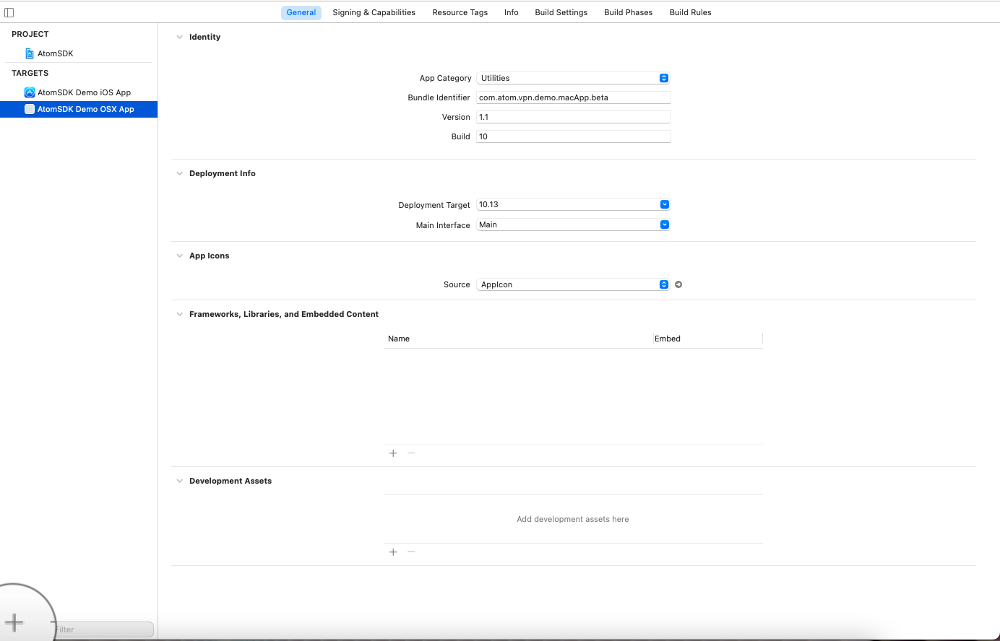


Now choose Network Extension under System Extension heading. 


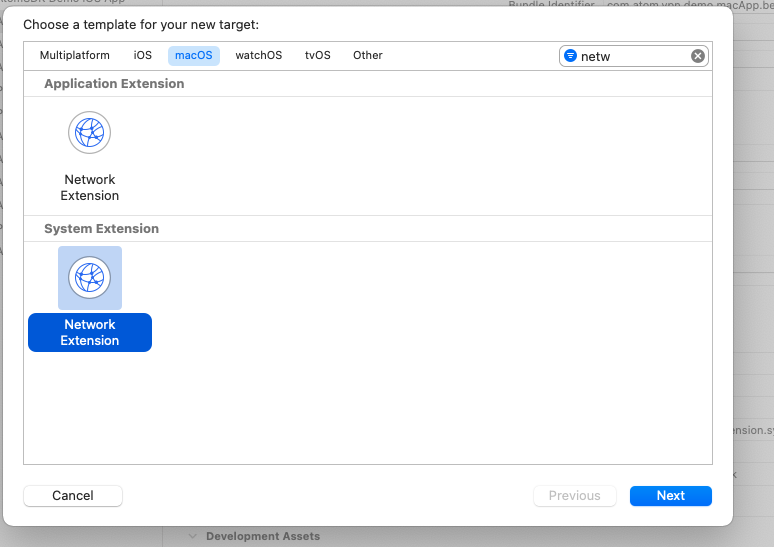

Now add relevant information while creating target. 


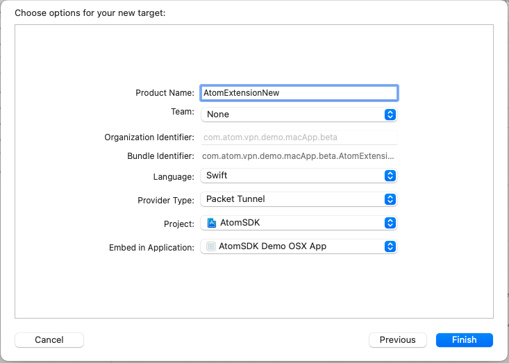


Congrats, new target has been created. But we need to configure it. 


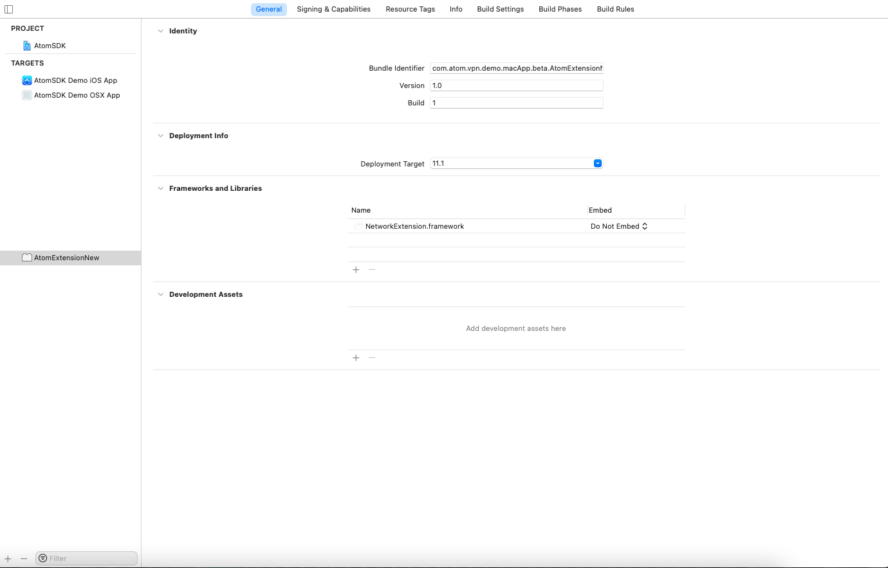

Go to capabilities tab on top of xcode and under Network Extension Capabilities please choose Packet Tunnel and enable Out going connection 


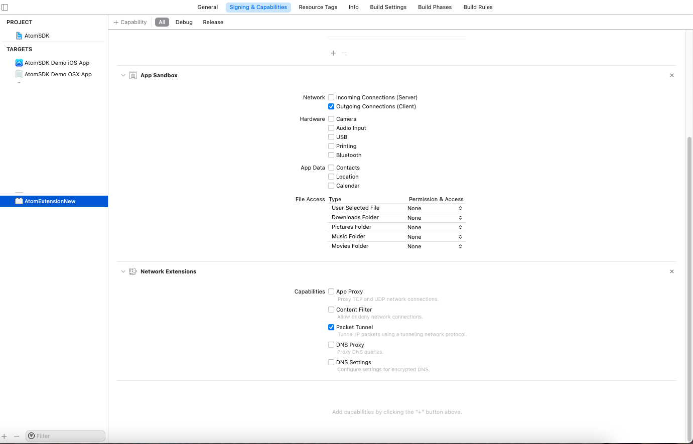

In your macOS application target add system extension capability. 


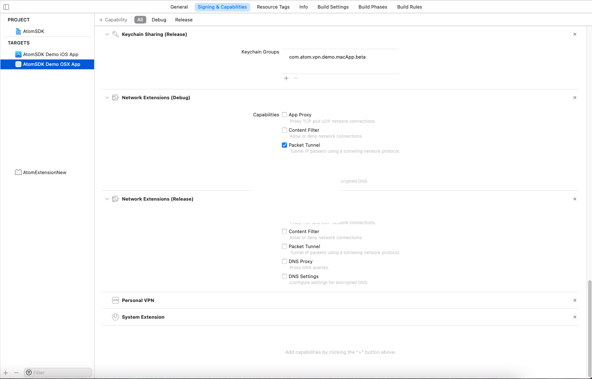


## Step # 2
Now let add the framework in dependency manager (Cocoapods) using the following command. 

**Note:** This framework must be added to Network extension target since this target will only be running in 10.15 macOS.

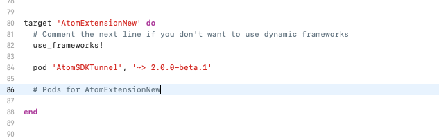


Let install Pod using, 

**pod install --verbose**

## Step # 3

Since there is a limitation on cocoapod to embed framework in System extension, we will be adding it manually. 

Press Plus sign under **Framework and Libraries**


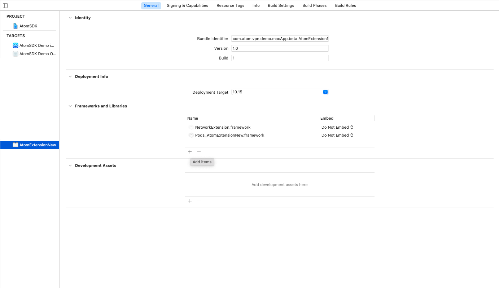

and select AtomOPVPNTunnel.xcframework, AtomSDKTunnel.xcframework, LZ4.xcframework, mbedTLS.xcframework, OpenVPNClient.xcframework for OpenVPN specific System Extension


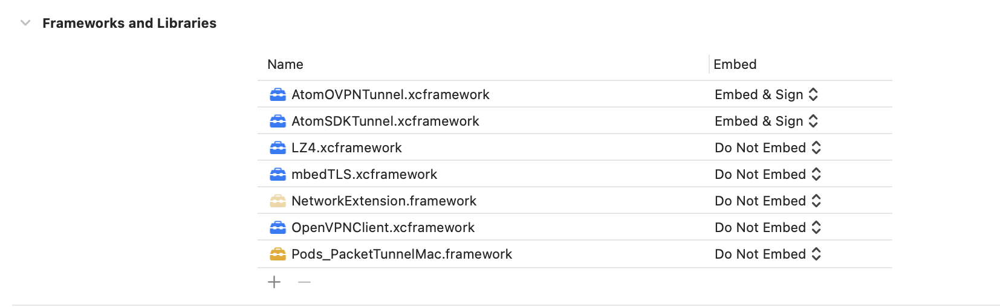


and select AtomWireguardTunnel for Wireguard specific System Extension


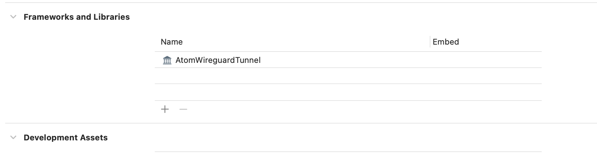


## Steps # 4

Here comes to the coding part. Simple pass the tunnel bundle identifier and app group identifier of new created target to AtomConfiguration class. 


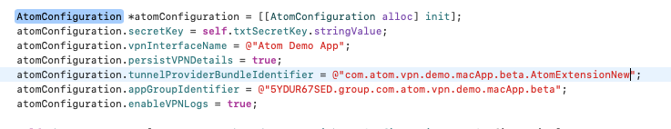

Note: You can enable/disable OpenVPN connection logs using the bit enableVPNLogs. 


In order to activate System Extension you need to call ExtensionManager's activeExtension method. **Note:**  **This should be done after AtomSDK being initialized.**


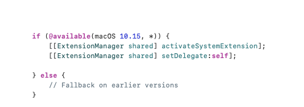

You should also listen to the ExtensionManagerDelegate in order to receive events. 


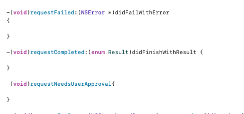


Open **PacketTunnelProvider** class which was created with newly created target and subclass it with **AtomPacketTunnelProvider** after importing **AtomSDKTunnel**.


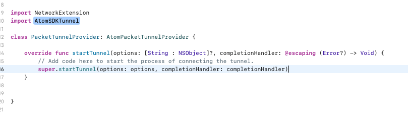


## Step # 5

In your Extension's info.plist, change the value of NEMachServiceName to be the App group's identifier. 


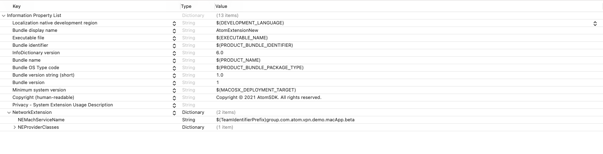


Wolaa, Integartion is completed. Time to test it. 

If you run your app system extension will ask for user's approval. 


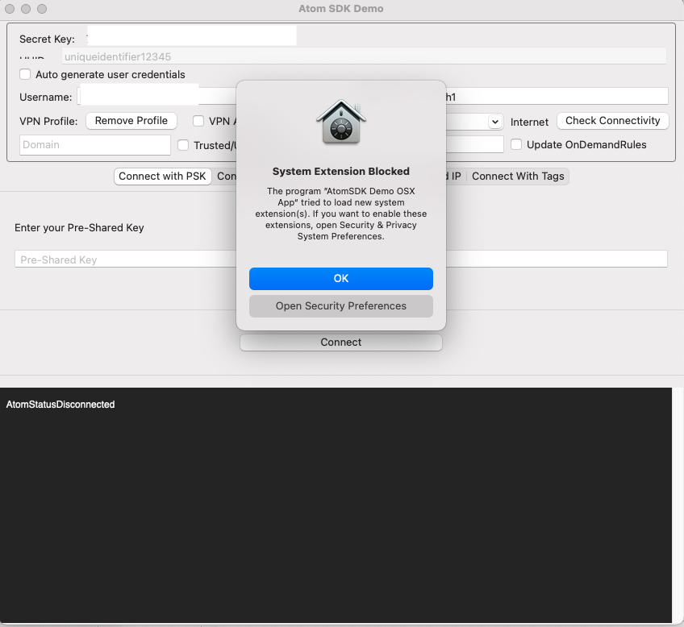


Which can be allowed from Security Preferences. 


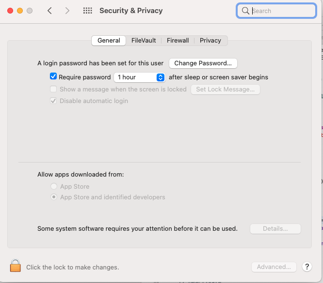


Once the system Extension is installed you can verify it using the following command. 

**systemextensionsctl list**


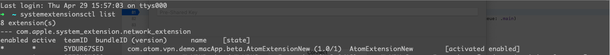


## Releasing App

In order to release the system extension there are few requirement. 

Entitlement file of Extension manager in release must have the following key value pair. 

```
<key>com.apple.developer.networking.networkextension</key>
	<array>
		<string>packet-tunnel-provider-systemextension</string>
	</array>
```

While in debug it should be the following 

```
<key>com.apple.developer.networking.networkextension</key>
	<array>
		<string>packet-tunnel-provider</string>
	</array>
```

