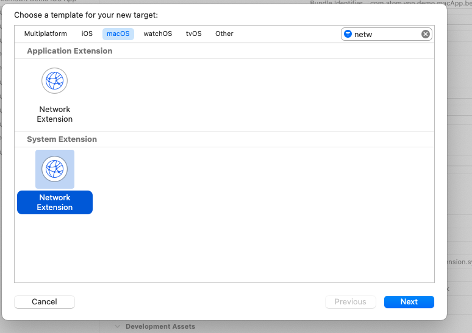
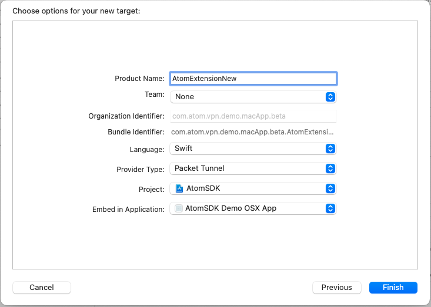
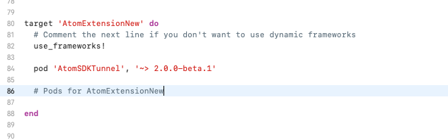
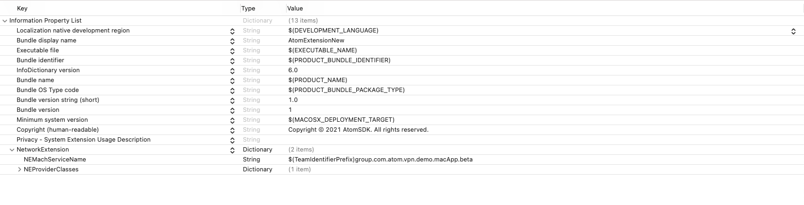
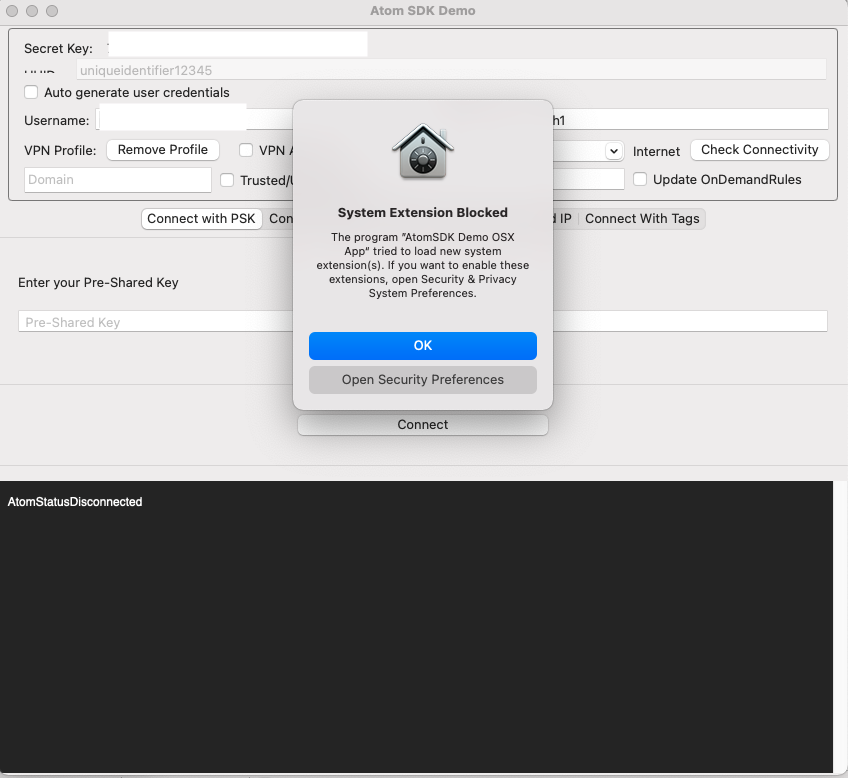

Setup System Extension

We are going to integrate AtomSDKTunnel in macOS application for dialing with TCP/UDP protocol. 

There are few steps that needs to followed carefully. 

Lets start setting up system extension. 

## Requirement
#### Operation System 
macOS 10.15

#### Capabilities
SystemExtension
Packet Tunnel (Network Extension)
Keychain Groups
App Groups


## Step # 1
## 
We need to add a new target. Press plus sign on bottom left of xcode where all the targets are listed. 


Now choose Network Extension under System Extension heading. 




Now add relevant information while creating target. 





Congrats, new target has been created. But we need to configure it. 


Go to capabilities tab on top of xcode and under Network Extension Capabilities please choose Packet Tunnel and enable Out going connection 


In your macOS application target add system extension capability. 


## Step # 2
Now let add the framework in dependency manager (Cocoapods) using the following command. 

**Note:** This framework must be added to Network extension target since this target will only be running in 10.15 macOS.




Let install Pod using, 

**pod install --verbose**

## Step # 3

Since there is a limitation on cocoapod to embed framework in System extension, we will be adding it manually. 

Press Plus sign under **Framework and Libraries**


and select AtomSDKTunnel.xcframework and openssl.xcframework


## Steps # 4

Here comes to the coding part. Simple pass the tunnel bundle identifier and app group identifier of new created target to AtomConfiguration class. 


Note: You can enable/disable OpenVPN connection logs using the bit enableVPNLogs. 


In order to activate System Extension you need to call ExtensionManager's activeExtension method. **Note:**  **This should be done after AtomSDK being initialized.**


You should also listen to the ExtensionManagerDelegate in order to receive events. 


Open **PacketTunnelProvider** class which was created with newly created target and subclass it with **AtomPacketTunnelProvider** after importing **AtomSDKTunnel**.


## Step # 5

In your Extension's info.plist, change the value of NEMachServiceName to be the App group's identifier. 





Wolaa, Integartion is completed. Time to test it. 

If you run your app system extension will ask for user's approval. 





Which can be allowed from Security Preferences. 


Once the system Extension is installed you can verify it using the following command. 

**systemextensionsctl list**


## Releasing App

In order to release the system extension there are few requirement. 

Entitlement file of Extension manager in release must have the following key value pair. 

```
<key>com.apple.developer.networking.networkextension</key>
	<array>
		<string>packet-tunnel-provider-systemextension</string>
	</array>
```

While in debug it should be the following 

```
<key>com.apple.developer.networking.networkextension</key>
	<array>
		<string>packet-tunnel-provider</string>
	</array>
```